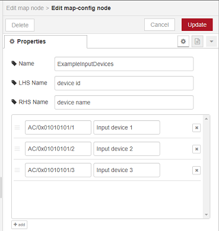
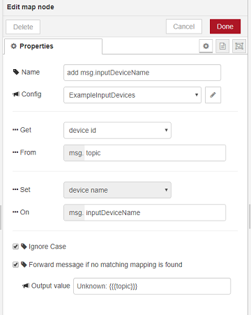
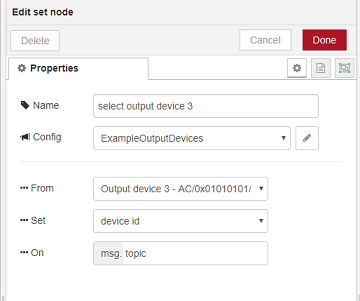
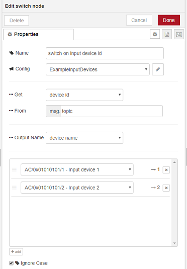
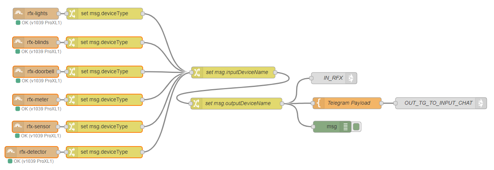
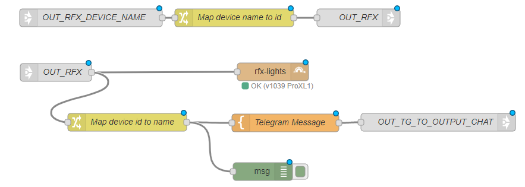

# node-red-contrib-map

This is a [Node-RED] plugin that provides a new *mappings* category with the 
following nodes:

* *map*: Allows for mapping a configurable property from an input message to a
  configurable property on the output message, based on the configured mappings. For 
  example, given an input message containing `topic:deviceId`, this node can add
  add a message property `topicName:deviceName`.
* *set*: Allows for adding a configurable property based on a specific mapping
  in the configured mappings. For example, this allows for adding a property 
  `topic:deviceId` for a given device to any input message.
* *switch*: Allows for switching between one or more outputs based on configured
  mappings. For example, given an input message containing `topic:deviceId`, 
  you can define separate outputs for device id `deviceId1` and `deviceId2`.

All mappings are configured through a configuration node, meaning that each of the nodes
listed above can re-use a pre-configured mapping. For example, you can have one configuration
that maps input device id's to device names, and another configuration that maps device names
to output device id's.

## Configuration node

The following screenshots show example configurations for mapping input device id's to
device names, and output device names to device id's:

The configuration node allows for configuring the following fields:

* *Name*: Name of the configuration.
* *LHS Name*: Name that describes the left-hand side of the mappings.
* *RHS Name*: Name that describes the right-hand side of the mappings.
* *List of mappings*: The list of mappings defined in this configuration. For example, if *LHS Name* is defined
  as `device id` and *RHS Name* is defined as `device name`, the input fields on the left specify
  actual device id's, and the input fields on the right specify the corresponding device names.
  
## Map node

The following screenshot shows an example configuration for the map node:

The map node allows for configuring the following fields:

* *Name*: Optional name for this node.
* *Config*: The mapping configuration to use (see above).
* *Get*: Whether to match the value from the message property configured in the *From* field against
  the left-hand side or right-hand side of the mapping. For example, if the configuration node
  specifies `device id` as the *LHS Name* and `device name` as the *RHS Name*, the *Get*
  property allows for specifying whether the input message property configured in the *From*
  field is expected to contain a `device id` or a `device name`.
* *From*: Which field to retrieve from the input message to be matched against the configured mappings.
* *Set*: Read-only field; if *Get* is set to the left-hand side of the mapping, then this field is set
  to the right-hand side of the mapping, and vice versa. For example, if *Get* is set to `device id`,
  then *Set* is set to `device name`, and vice versa.
* *On*: This field specifies which message property to set to the mapped value, if a mapping is found based on 
  the *Get* and *From* fields.
* *Ignore Case*: Whether to ignore case when matching the input message property configured through *From*
  to the configured list of mappings. For example, if *Ignore Case* is enabled, an input 
  message property containing `MyDeviceName` will match a mapping containing `mydevicename`.
* *Forward message if no matching mapping is found*: If disabled, the message will not be forwarded if no
  mapping is found. If enabled, you can specify a default value to be added to the message property identified
  by the *On* field, as configured through the *Output value* property.
* *Output value*: Default value to set on the *On* message property if no mapping is found. This field can
  use Mustache syntax, and by default will be set to something like `Unknown: {{{payload}}}`.      
    
## Set node
 
The following screenshot shows an example configuration for the set node:
 

 
The set node allows for configuring the following fields:
 
* *Name*: Optional name for this node.
* *Config*: The mapping configuration to use (see above).
* *From*: Which mapping to use as input to set the output message property.
* *Set*: Whether to set the left-hand side or right-hand side of the configured mapping as the 
  message output property.
* *On*: This field specifies which message property to set based on the *From* and *Set* fields.
 
## Switch node
 
The following screenshot shows an example configuration for the switch node:
 

 
The switch node allows for configuring the following fields:
 
* *Name*: Optional name for this node.
* *Config*: The mapping configuration to use (see above).
* *Get*: Whether to match the value from the message property configured in the *From* field against
  the left-hand side or right-hand side of the mapping. For example, if the configuration node
  specifies `device id` as the *LHS Name* and `device name` as the *RHS Name*, the *Get*
  property allows for specifying whether the input message property configured in the *From*
  field is expected to contain a `device id` or a `device name`.
* *From*: Which field to retrieve from the input message to be matched against the configured mappings.
* *Output Name*: Specifies whether the switch output labels shown in the Node-RED user interface should show
  the left-hand side or right-hand side of the mapping. For example, if the configuration node
  specifies `device id` as the *LHS Name* and `device name` as the *RHS Name*, the *Output Name*
  property allows for specifying whether the switch output label should show either the `device id` 
  or `device name`.
* *List of switches*: Matches a given input message against the configured mapping, and invokes the
  corresponding switch output.
* *Ignore Case*: Whether to ignore case when matching the input message property configured through *From*
  to the configured list of mappings. For example, if *Ignore Case* is enabled, an input 
  message property containing `MyDeviceName` will match a mapping containing `mydevicename`.
     
## Simple flow examples

The following sections show some example flows with the various nodes provided by this plugin.

### Add Device Names

This flow demonstrates the *map* node.

If a mapping exists for the input device id, this flow adds the input device name to the message
if a mapping exists. If no mapping exists, this flow will add `Unknown: [device id]` as the
input device name. 

If the given input device is mapped to a corresponding output device (i.e. if a motion sensor directly
controls some output device), this flow will also add the output device name to the message. If no
output device is known for the given input device, this flow will add `None` as the output device name.

The JSON configuration for this flow can be found here: [addDeviceNames-flow.json](examples/flows/addDeviceNames-flow.json).

### Select Output Device

This flow demonstrates the *set* node.

Given some input trigger, this flow will send a message to an output device configured through the output
device mapping configuration.

The JSON configuration for this flow can be found here: [selectOutputDevice-flow.json](examples/flows/selectOutputDevice-flow.json).

### Switch on Input Device

This flow demonstrates the *switch* node.

Given some input message, this flow will select between switch outputs based on the configured device mapping configuration.

The JSON configuration for this flow can be found here: [switchOnInputDevice-flow.json](examples/flows/switchOnInputDevice-flow.json).

## Screenshots of more elaborate examples

The following screenshots show more eleborate examples on how to use the nodes provided by this plugin.
These screenshots are taken from my own Node-RED configuration. To avoid potentially leaking sensitive
information, only screenshots and generic descriptions are provided; no JSON flows are available.

### RFXCom In

For every input provided by node-red-contrib-rfxcom, this flow does the following:

* Add a `msg.deviceType` property using the standard Node-RED `change` node. For example, 
  `msg.deviceType` can be set to `lights` or `blinds`.
* Add a `msg.inputDeviceName` property using the *map* node provided by this plugin, configured with
  mappings between input device id's and input device names.
* Add a `msg.outputDeviceName` property using the *map* node provided by this plugin, configured with
  mappings between output device names and output device id's.
* The resulting message is sent to the debug output, a Telegram message, and to a *link out* node to which
  other flows can connect.
  
### RFXCom Out

 
 
 This flow provides the two *link in* nodes named `OUT_RFX` and `OUT_RFX_DEVICE_NAME`.
 
 `OUT_RFX`:
 
 * Expects `msg.topic` to contain the output device id, and `msg.payload` to contain the output device action.
 * Sends the message as-is to the `rfx-lights` node.
 * Retrieves the device name for the device id given in `msg.topic`, using the *map* node provided by this plugin
   configured with mappings between output device names and device id's, and then logs the message and sends a Telegram
   message containing the output device name and action.
   
`OUT_RFX_DEVICE_NAME`:

* Expects `msg.outputDeviceName` to contain the output device name, and `msg.payload` to contain the output device action.
* Add the `msg.topic` property containing the device id corresponding to the given output device name, using the *map*
  node provided by this plugin, configured with mappings between output device names and output device id's.
* Invokes the `OUT_RFX` link with the updated message.

### HTTP Control

This flow takes incoming HTTP GET requests to /device, extracts the device name and action from the request
parameters, and then invokes `OUT_RFX_DEVICE_NAME` (see above). Note that this flow doesn't use any of the
nodes provided by this plugin, but it utilizes the device name to device id mapping provided by the
`OUT_RFX_DEVICE_NAME` link.

### Night Light 

This flow is triggered around sunset to turn on a night light, and triggered at a specific time to turn the 
night light off again. It utilizes the *set* node provided by this plugin to set `msg.topic` to the output 
device id to be controlled.

## Version history

* _1.0.1_: Some documentation updates & fixes
* _1.0.0_: Initial version
  
[Node-RED]:  http://nodered.org/  

